<!--
    SPDX-FileCopyrightText: 2025-present Krys Lawrence <aquarion.5.krystopher@spamgourmet.org>
    SPDX-License-Identifier: CC-BY-SA-4.0
-->

<!--
    aquarion-docs documentation © 2025-present by Krys Lawrence is licensed under
    Creative Commons Attribution-ShareAlike 4.0 International. To view a copy of this
    license, visit <https://creativecommons.org/licenses/by-sa/4.0/>
-->

# Conceptual Component Designs

This document describes and diagrams the core design ideas of each component of
Aquarion AI and shows various alternative ways they could be built.

## Introduction

The overall design plan is for each component to have a modular front interface, back
interface and core logic in the middle.  This way not only can Aquarion AI support
multiple different kinds of third-party components but also each Aquarion AI component
can be combined in different architectural patterns and using a variety of protocols to
communicate with each other.

_The key idea is to be able to mix and match the front and back parts while preserving
he core logic.  This should be possible by having clear interface contracts between each
of the 3 parts._

## Event Driven Microservice Designs

All the variants below assume an Event Driven Architecture (EDA) with an Event Broker
component as the central component.

### Diagram 1: EDA Microservice Variant A

In this microservice variant the component is running as a microservice in an Event
Driven Architecture (EDA) style and relies on a third-party backend service to provide
the functionality.

Examples of this style could include:

- MQTT to the Broker and Ollama as the backend for the LLM component
- NATS to the Broker and Fabric as the backend for the Prompt Augmentation component
- AMQP to the Broker and Redis as the backend for the State Storage component
- Kafka to the Broker and OAuth or LDAP as the backend for the Identity Management
  component
- etc.

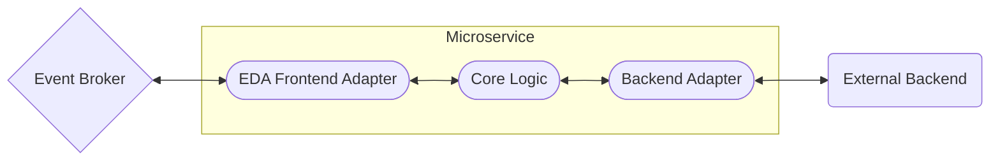

### Diagram 2: EDA Microservice Variant B

In this microservice variant the component is running as a microservice in an Event
Driven Architecture (EDA) style and relies on third-party libraries / packages /
frameworks to provide the functionality.

Examples of this style could include:

- MQTT to the Broker and Kokoro TTS for the TTS component
- NATS to the Broker and Whisper for the STT component
- AMQP to the Broker and SQLite for the State Storage component
- etc.

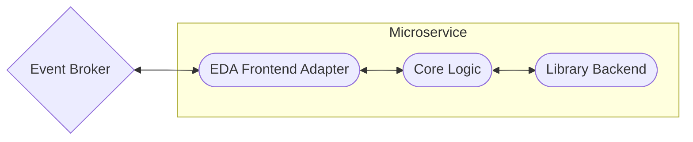

### Diagram 3: EDA Microservice Variant C

In this microservice variant the component is running as a microservice in an Event
Driven Architecture (EDA) style but depends on another EDA microservice in order to
fully provide it's functionality.

Examples of this style could include:

- MQTT to the Broker and Identity Management component relying on the State Storage
  component also being connected to the Broker.
- etc.

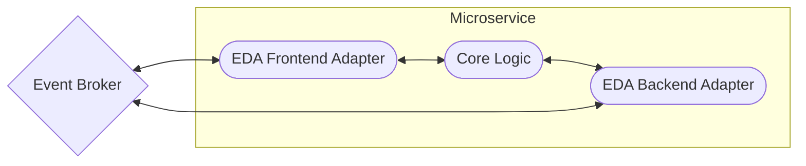

### Diagram 4: EDA Microservice Variant D

In this microservice variant the component is running as a microservice in an Event
Driven Architecture (EDA) style but fully implements all functionality itself.

Examples of this style could include:

- MQTT to the Broker and the State Storage component storing files to disk?
- NATS to the broker and additional Agent Service components (in the future)?
- etc.

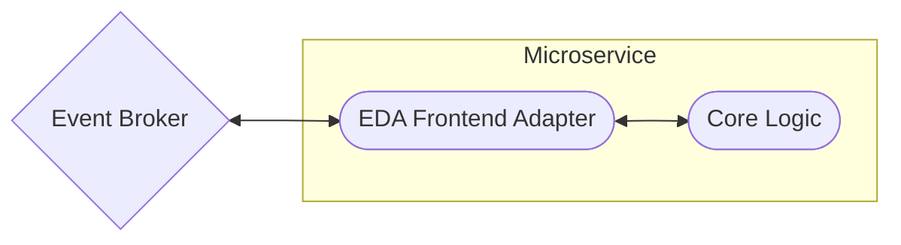

### Diagram 5: EDA Microservice Variant E

In this microservice  variant the component is running as a microservice in an Event
Driven Architecture (EDA) style but this time presents a non-EDA / Point To Point (P2P)
/ Request - Response API to the system.

Examples of this style could include:

- A REST API frontend and MQTT to the Broker for the API component
- A gRPC API frontend and NATS to the Broker for the API component
- A ZeroMQ API frontend and NATS to the Broker for the API component
- etc.

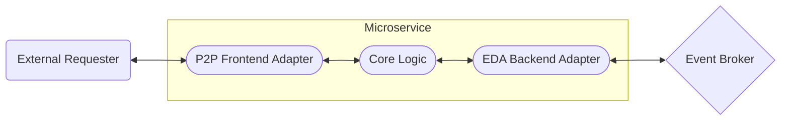

## Point To Point Microservices Designs

As with the EDA microservice designs presented above, if one removes the Event Broker
and relies on Point to Point (P2P), a.k.a. Request - Response, APIs instead, then all
the same patterns as above are possible, just with the trade-off of more complex
connection coordination.

### Diagram 6: P2P Microservice Variant A

In this microservice variant the component is running as a microservice with a Point To
Point (P2P) API and relies on a third-party backend service to provide the
functionality.

Examples of this style could include:

- A REST API and Ollama as the backend for the LLM component
- A gRPC and Fabric as the backend for the Prompt Augmentation component
- A GraphQL API and Redis as the backend for the State Storage component
- A SOAP API and OAuth or LDAP as the backend for the Identity Management component
- etc.

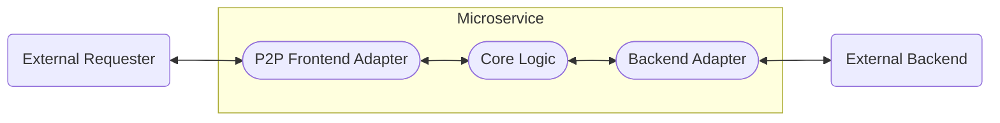

### Diagram 7: P2P Microservice Variant B

In this microservice variant the component is running as a microservice with a Point To
Point (P2P) API and relies on third-party libraries / packages / frameworks to provide
the functionality.

Examples of this style could include:

- A REST API and Kokoro TTS used for the TTS component
- A gRPC and Whisper uses for the STT component
- A GraphQL API and SQLite used for the State Storage component
- etc.

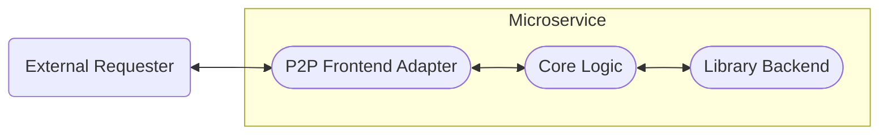

### Diagram 8: P2P Microservice Variant C

In this microservice variant the component is running as a microservice with a Point To
Point (P2P) API but depends on another EDA microservice in order to fully provide it's
functionality.

Examples of this style could include:

- A REST API and the Identity Management component relying on the State Storage
  component.
- A REST API for the API component that then orchestrates interaction with all the other
  component microservices.
- A REST API for the API component that then forwards requests to the other component
  microservices as appropriate.
- A gRPC API for the API component that then forwards requests to the other component
  microservices via a REST APIs.
- etc.

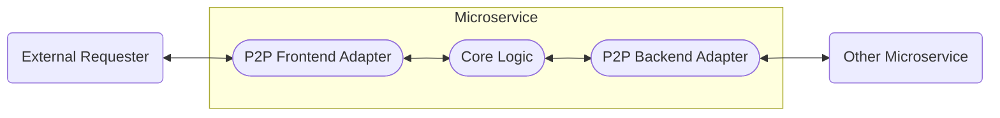

### Diagram 9: P2P Microservice Variant D

In this microservice variant the component is running as a microservice with a Point To
Point (P2P) API but fully implements all functionality itself.

Examples of this style could include:

- A REST API and the State Storage component storing files to disk?
- A gRPC API and additional Agent Service components (in the future)?
- etc.

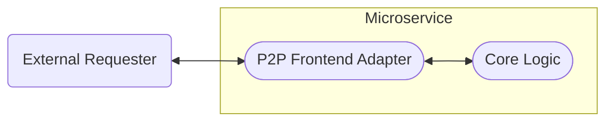

## Monolithic Service Designs

While the above designs split each Aquarion AI component out in to separate
microservices using a variety of interconnection styles, one could also directly
interact with each component's core logic module within a single monolithic service
design.  This simplifies complexity and reduces latency when scaling and distributed
computing are not the most important concerns.

### Diagram 10: Monolithic Service Variant A

In this monolithic service variant, all Aquarion AI components are included in a single
service.  External requests are simply routed to the appropriate component through an
internal queue and then processed by one or more workers.  The workers can be
implemented in a multi-processing, multi-threaded or asynchronous way.

This variant requires the external client to track and manage the workflow / order of
operations.  This could be desirable for granularity and a more interactive client
experience.

Examples of this style could include:

- A REST API and asynchronous workers
- A gRPC API and threads for workers
- A SOAP API and subprocesses for workers
- etc.

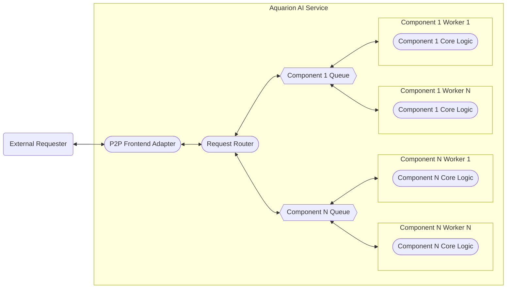

### Diagram 11: Monolithic Service Variant B

In this monolithic service variant, all Aquarion AI components are included in a single
service.  External requests are dispatched through an internal queue to workers that
each orchestrate the full interaction with all components and then return the results.
The workers can be implemented in a multi-processing, multi-threaded or asynchronous
way.

This variant takes care of handling the workflow / order of operations so that the
client does not have to.  This could be desirable for making clients simpler if
granularity and high interactivity is not required.

Examples of this style could include:

- A REST API and asynchronous workers
- A gRPC API and threads for workers
- A SOAP API and subprocesses for workers
- etc.

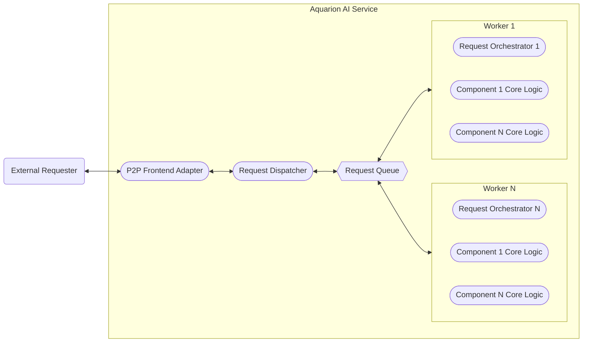

## Single User Application Designs

Scaling down to a single user desktop application affords even greater simplicity, of
course, at the cost of putting all resource demands on the clients own computer.

### Diagram 12: Single User Application Variant A

In this single user application variant, an Electron App or similar would maintain the
same Web-based User Interface (UI) as the above client - server designs, but would use
an internal subprocess to run all the component core logic modules.  Communication
between the UI and the subprocess would be handled via Remote Procedure Call (RPC) or
some other Inter-Process Communication (IPC) method.  This design allows the UI and the
backend components to be coded in different programming languages, which is an
advantage, but comes at the cost of IPC/RPC overhead.

Examples of this style could include:

- Using REST for IPC.
- Using zerorpc for IPC.
- Using pipes for IPC.
- etc.

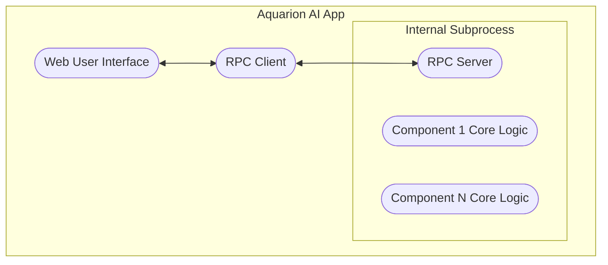

### Diagram 13: Single User Application Variant B

In this single user application variant, all components including the User Interface
(UI) are coded in the same programming language, removing the need any kind of
multi-processing and Inter-Process Communication (IPC).  This design does, however,
force the UI and the backend components to be coded in the same programming language.
This increases simplicity, but reduced flexibility and possibly even forces the creation
of a non-reusable UI component.

Examples of this style could include:

- An Application with a Graphical User Interface (GUI)
- An Application with a Text User Interface (TUI)
- An Application with a Command Line Interface (CLI)
- etc.

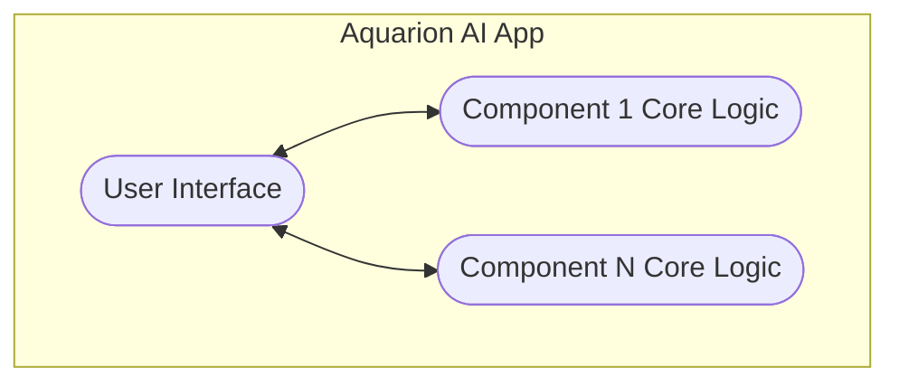

## Concluding Thoughts

Please the Concluding Thoughts section of the
[Conceptual System Architectures](system_architectures.md) document as I
have nothing extra to add here.
