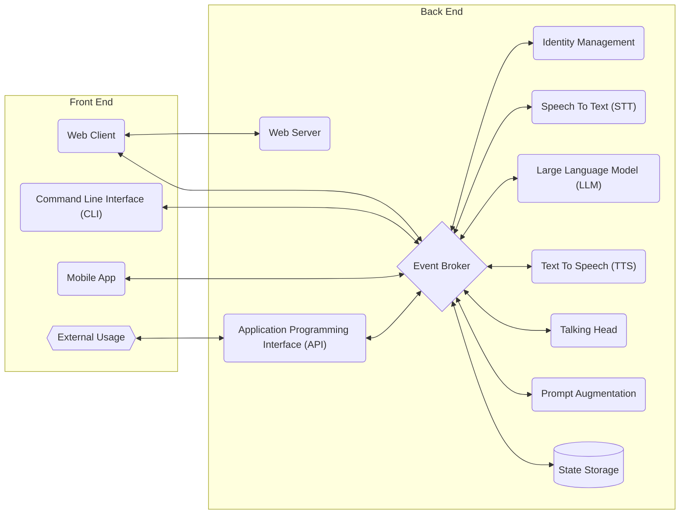
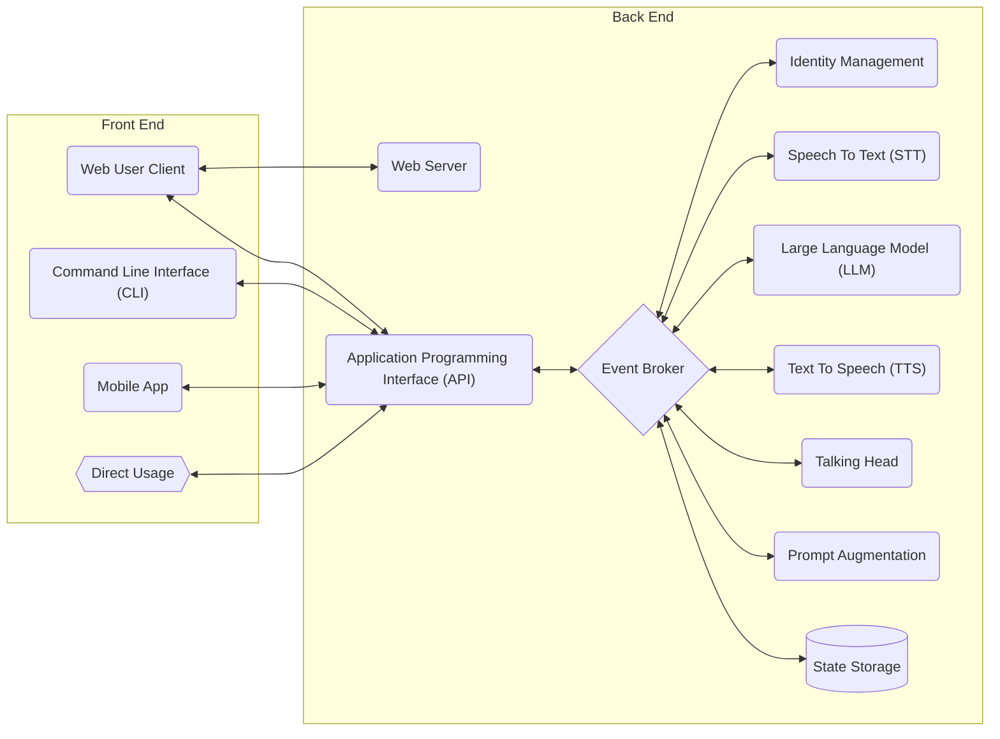
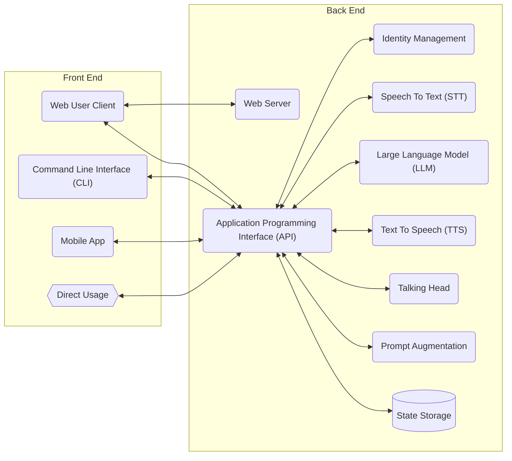
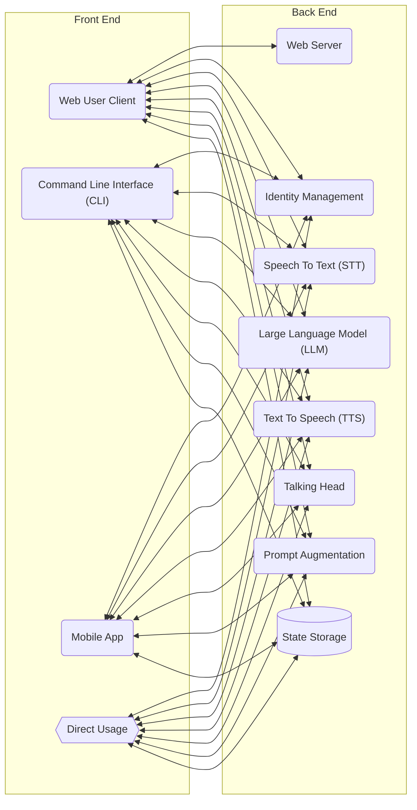
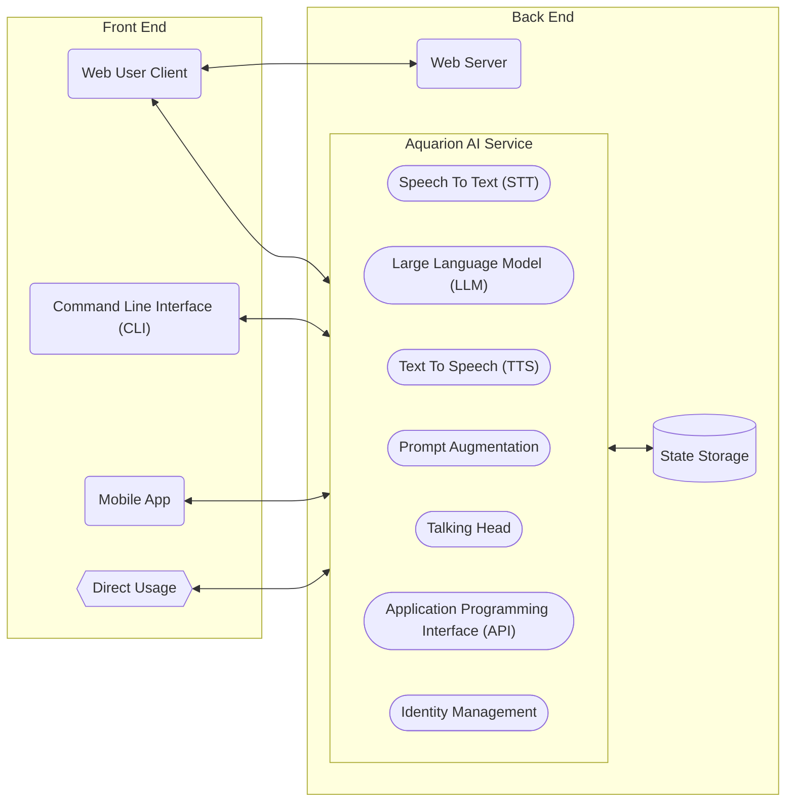
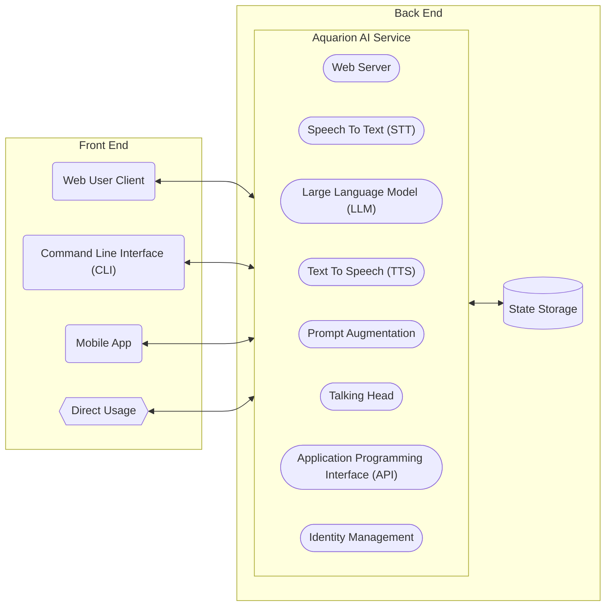
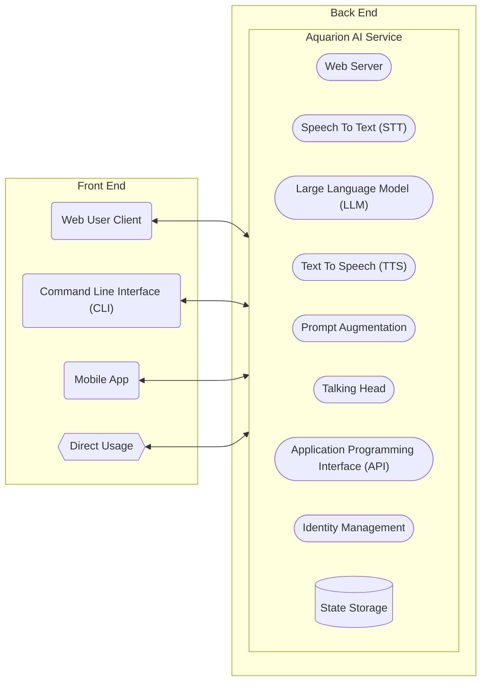
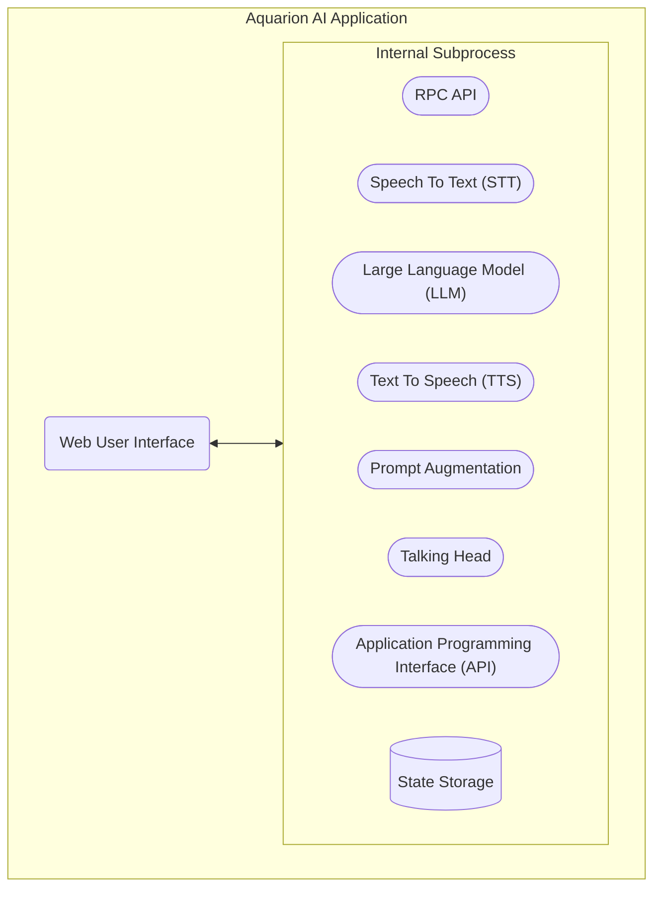
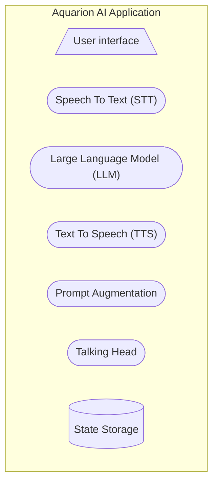

<!--
    SPDX-FileCopyrightText: 2025-present Krys Lawrence <aquarion.5.krystopher@spamgourmet.org>
    SPDX-License-Identifier: CC-BY-SA-4.0
-->

<!--
    aquarion-docs documentation © 2025-present by Krys Lawrence is licensed under
    Creative Commons Attribution-ShareAlike 4.0 International. To view a copy of this
    license, visit <https://creativecommons.org/licenses/by-sa/4.0/>
-->

# Conceptual System Architectures

This document describes and diagrams the core architectural components of Aquarion AI
and shows various ways in which they can be assembled in order to balance scalability vs
complexity.

## Introduction

The overall architectural plan is to be modular enough to support multiple backends and
to be able to scale both down to a single local desktop app and up to a distributed
horizontally scalable multi-server system.

## Distributed, Scalable Architectures

### Diagram 1: Distributed, Scalable System Variant A

In this distributed system variant, each component runs as a separate microservice and
uses Event Driven Architecture (EDA) for all Inter Process Communication (IPC),
including all the way out to the Web Client and Command Line Interface (CLI).  The API
component is only, then, used for external systems that require a non-EDA interface.
Authentication and security need to be handled by the Event Broker itself.

This architecture might be better / more performant if most end users are internal to
one's organization since there is less protocol hopping and the same IPC is uses
everywhere.  One could even not bother with the API microservice at all if there is no
demand for it.

And, of course, each component can be scaled horizontally, load balanced, etc.

### Diagram 2: Distributed, Scalable System Variant B

In this distributed system variant, each component runs as a separate microservice and
uses Event Driven Architecture (EDA) for internal Inter Process Communication (IPC).
However the end user facing components all route through the API component in a more
traditional, non-EDA way.  Authentication and security would also be handled by the API
component.

This architecture might be better if end users are primarily external to one's
organization.

And, of course, each component can be scaled horizontally, load balanced, etc.

### Diagram 3: Distributed, Scalable System Variant C

In this distributed system variant, each component runs as a separate microservice but
does not use an Event Driven Architecture (EDA) for Inter Process Communication (IPC).
Here it falls on the API component to either:

1. Handle all communication ochistration to and from all the other backend components,
   or
1. To simply pass through all requests to the appropriate backend, only being
   responsible for security and API integration, etc.

This architecture removes the Event Broker component, but now requires the API server to
track and maintain many point-to-point connections.  It also makes adding additional
components more difficult.

And, of course, each component can be scaled horizontally, load balanced, etc.

### Diagram 4: Distributed, Scalable System Variant D

In this distributed system variant, each component runs as a separate microservice and
each front end component connects directly to each back end component as needed.  That
puts the burden of authentication and security on every backend component and requires
that each front end keep track of every back end component.

_Clearly this architecture is a nightmare.  It will **not** be implemented or
supported._

I principle, however, each component can be scaled horizontally, load balanced, etc.

## Single Server, Vertically Scalable System

While it is certainly possible to run any of the above distributed architectures on a
single server, it is also possible to greatly simplify the inter-component communication
overhead if everything ran as a single multi-process, multi-threaded or asynchronous
service.

### Diagram 5: Single Server System Variant A

In this single server variant, the Web Server and State Storage are kept as external
services but all other components are included together in a single service.  All
inter-component communication is handled within the server application itself in a
multi-threaded, multi-process or asynchronous safe manner.

This architecture could still be scaled horizontally, but it is much less flexible and
puts all the GPU / TPU demand together with no ability to split it up.  While this
reduces IPC overhead, it could force the use of smaller LLM models or greater GPU
requirements.  And it could even be slower overall, in principle.  ... Or not.

### Diagram 6: Single Server System Variant B

In this single server variant, only the State Storage is kept as external service and
all other components are included together in a single service.  All inter-component
communication is handled within the server application itself in a multi-threaded,
multi-process or asynchronous safe manner.  This can be accomplished if the Web Client is
built as a Single Page Application (SPA) or if all components are coded in the same
programming language.

This architecture could still be scaled horizontally, as the State Storage component
can be shared amongst all servers and scaled independently as needed.  But the
architecture is much less flexible and puts all the GPU / TPU demand together with no
ability to split it up.  While this reduces IPC overhead, it could force the use of
smaller LLM models or greater GPU requirements.  And it could even be slower overall, in
principle.  ... Or not.

### Diagram 7: Single Server System Variant C

In this single server variant, the Web Server and State Storage are are included with
all the other components in a single service.  All inter-component communication is
handled within the server application itself in a multi-threaded, multi-process or
asynchronous safe manner.  This can be accomplished if the Web Client is built as a
Single Page Application (SPA) or if all components are coded in the same programming
language.  Also, the State Storage would have to be handled internally via embedded
database or files on disk, etc.

This architecture is _not really suited to scaling_ horizontally, but could still be
scaled vertically.  Also it is much less flexible and puts all the GPU / TPU demand
together with no ability to split it up.  While this reduces IPC overhead, it could
force the use of smaller LLM models or greater GPU requirements.  And it could even be
slower overall, in principle.  ... Or not.

## Desktop Application

All of the above variants assume a client <-> server architecture.  But Aquarion AI
could be scaled down to a single, all-in-one desktop application as well.

### Diagram 8: Desktop Application Variant A

In this desktop application variant, the application process spins up an internal
backend service and then presents the Web-based User Interface (UI) as the application
main window. This could be accomplished by building an Electron application, for
example, or using a similar kind of framework.  All inter-component communication would
be handled within via a Remote Procedure Call (RPC) API or other Inter-Process
Communication (IPC) method for simplicity and performance.  This would still require the
UI to be built using Web-based technologies, but it does still allow for the other
components to be coded in a programming language other than JavaScript. Also, the State
Storage would be handled internally via embedded database or files on disk, etc.
This architecture provides a simplified single user experience but also requires the
user to have sufficient local GPU / TPU capability on their own computer.

### Diagram 9: Desktop Application Variant B

In this desktop application variant, any of the following could be used instead of a
Web Client for the User Interface (UI):

- A Graphical User Interface (GUI),
- A Text User Interface (TUI),
- A Command Line Interface (CLI), or
- A Mobile User Interface (MUI?)

This User Interface (UI) can be coded in the same programming language as the other
components, allowing absolutely everything to run under a single runtime or even a
single process.  No server components at all.  As with the single server variants above,
all inter-component communication is handled in a multi-threaded, multi-process or
asynchronous safe manner.  Also, the State Storage would be handled internally via
embedded database or files on disk, etc.

This architecture provides a simplified single user experience but also requires the
user to have sufficient local GPU / TPU capability on their own device.  Additionally,
if a desktop GUI is used, it would not be a reusable component.

## Concluding Thoughts

1. As I have a strong preference for coding in Python for the backend components, I
   think that any architecture that requires all components to be coded in the front end
   language, i.e. JavaScript, are off the table for consideration.

1. As I have little interest in an all-mobile single application, and as I do not
   believe we will have phones powerful enough to run decent LLMs any time soon, then
   this rules out any mobile-related architecture that would require me to code all
   components in a mobile programming language, i.e. Java on Android and ObjectiveC on
   iPhone, or whatever.

1. Given the above two conclusions, sticking to a client <--> server architecture for
   now is the way to go.  But I will need to keep in mind the Electron-based (or
   similar) packaging of the components as I design and code them.
